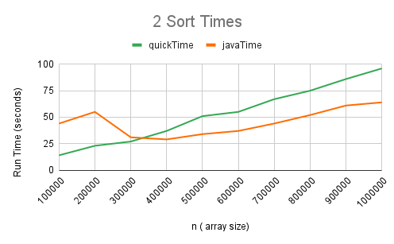
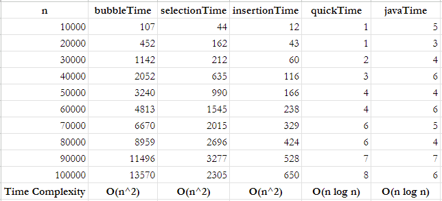
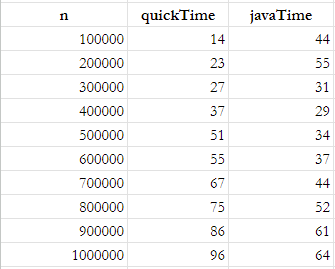

#  Sort Timer Evaluation
## Line Plots

.png "5 Sort Times (Zoomed In)")

## Time Complexity Tables

## Summary

As you increase the data set for bubble sort, selection sort, and insertion sort, their run time 
grows quadratically as the input size increases. This is due to the fact that they have 
a time complexity of O(n^2), so their executions times will grow exponentially, meaning that 
they are not suitable for large datasets due to their poor scalability.

As you increase the data set for quick sort and java sort the run time grows less rapidly compared 
to quadratic-time algorithms such as above. This is due to the fact that it has a time complexity 
of O(n log n), so generally it is more efficient for large datasets due to its better scalability.

In terms of the provided quick sort algorithm and Java's Arrays.sort(), Java's built-in sorting 
algorithm has a smaller execution time. This is because it is highly optimized and designed to perform 
well in many different scenarios, especially compared to custom implementations such as the provided 
quick sort algorithm in this case.
