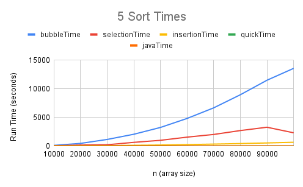
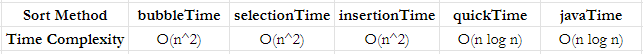

#  Sort Timer Evaluation
## Line Plots

.png "5 Sort Times (Zoomed In)")

## Time Complexity Tables

## Summary

As you increase n for bubbleTime, selectionTime, and insertionTime their time to run grows
quadratically as the input size increases. This is due to the fact that they have a time 
complexity of O(n^2), so their executions times will grow exponentially meaning that they 
are not suitable for large datasets due to their poor scalability.

